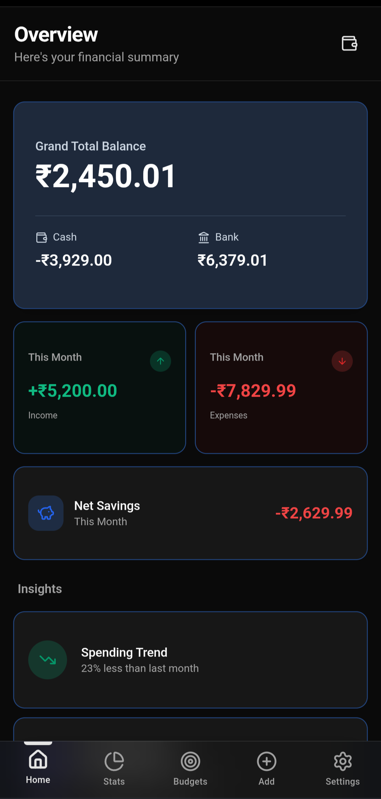
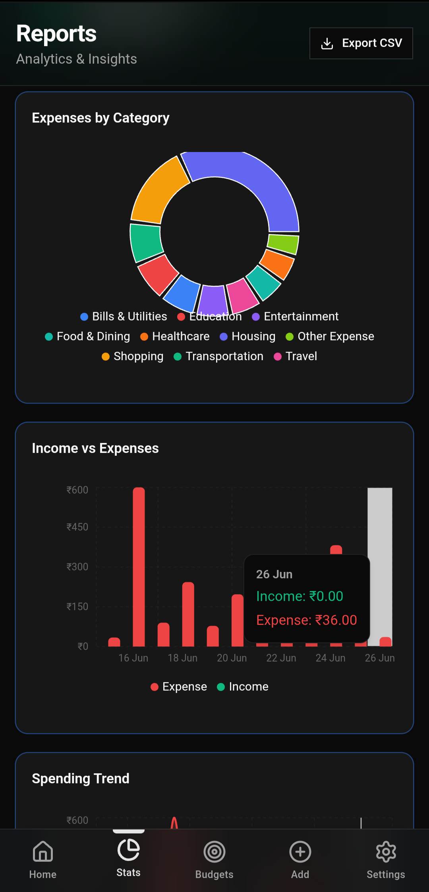
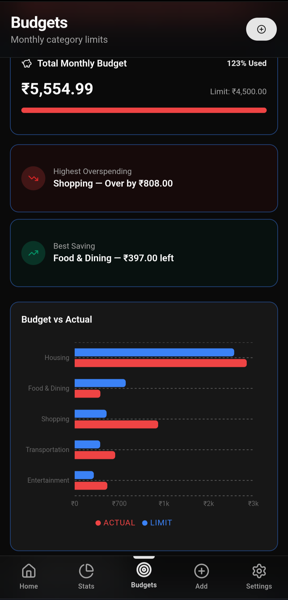
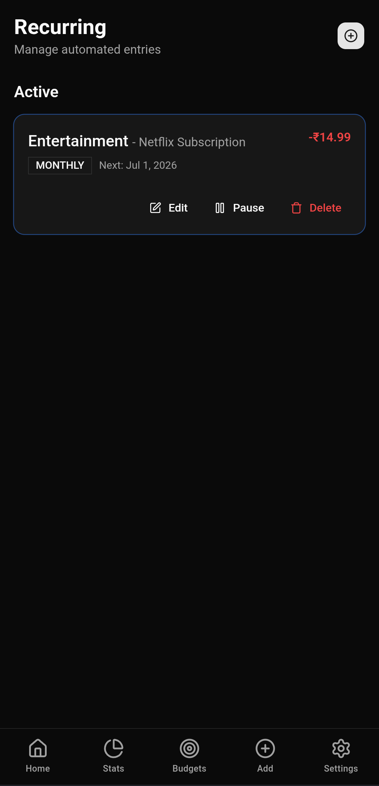

# Expenses PWA

A premium, offline-first personal finance tracker built as a Progressive Web App (PWA). Take control of your money with zero friction, intelligent analytics, and absolute privacy.

 <!-- Add your banner screenshot here -->

## 🌟 Features

- **Offline-First Privacy**: Your financial data is securely stored on your local device using IndexedDB. No servers, no tracking, total privacy.
- **Progressive Web App**: Installable on iOS and Android. Looks, feels, and performs exactly like a native app.
- **Smart Analytics**: Visualize your spending patterns with beautiful charts and automatically tracked category insights.
- **Budget Tracking**: Set up monthly limits for categories and receive visual warnings when you are close to overspending.
- **Recurring Transactions**: Automate your subscriptions, rent, and salary. The app will log them exactly when they are due.
- **Premium UX**: Smooth transitions, glassmorphism UI, safe-area padded layouts, and a meticulously crafted dark mode.

## 📱 Screenshots

| Dashboard | Analytics | Budgets | Recurring |
| :---: | :---: | :---: | :---: |
|  |  |  |  |

*(Replace with your actual screenshots after generating demo data)*

## 🛠️ Tech Stack

- **Framework**: [Next.js 16 (App Router)](https://nextjs.org/)
- **Styling**: [Tailwind CSS v3](https://tailwindcss.com/)
- **UI Components**: [shadcn/ui](https://ui.shadcn.com/) (Radix UI)
- **Database**: [Dexie.js](https://dexie.org/) (IndexedDB Wrapper)
- **State Management**: [Zustand](https://github.com/pmndrs/zustand)
- **Icons**: [Lucide React](https://lucide.dev/)
- **PWA Capabilities**: `@ducanh2912/next-pwa`

## 🚀 Getting Started

### Prerequisites
- Node.js 18.x or later
- npm or pnpm

### Installation

1. **Clone the repository**
   ```bash
   git clone https://github.com/yourusername/expense-tracker.git
   cd expense-tracker
   ```

2. **Install dependencies**
   ```bash
   npm install
   ```

3. **Start the development server**
   ```bash
   npm run dev
   ```
   The app will be available at `http://localhost:3000`.

### Generating Demo Data

For portfolio presentations and taking screenshots, you can instantly populate the app with realistic data:
1. Run the app and navigate to the **Settings** page.
2. Scroll down to the **Danger Zone** section.
3. Click **Generate Demo Data**.
*Note: This will wipe your current database and insert 90 days of transactions and budgets.*

## 🏗️ Architecture

- **`src/app`**: Next.js App Router structure. Contains all pages and layouts.
- **`src/components`**: Reusable UI components grouped by feature domain (`transactions`, `settings`, `layout`, etc.).
- **`src/hooks`**: Custom React hooks handling business logic (`useDashboard`, `useReports`, `useBudgets`).
- **`src/lib`**: Core utilities, IndexedDB schema definitions (`db.ts`), analytics math, and Zustand stores.

## 🌐 Deployment

This project is optimized for deployment on Vercel.

```bash
npm run build
npm start
```
The application requires HTTPS in production for the Service Worker (PWA functionality) to register correctly.

## 🤝 Contributing

Contributions, issues, and feature requests are welcome!
Feel free to check the [issues page](https://github.com/yourusername/expense-tracker/issues).

## 📝 License

This project is licensed under the MIT License - see the [LICENSE](LICENSE) file for details.
